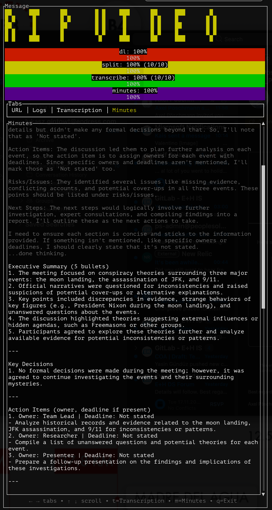

# rip-video

This repository includes a TUI to download audio, split into parts, transcribe with ffmpeg-whisper, generate meeting minutes using a local Ollama model.

How to use (macOS)
- grab youtube link
- In your browser DevTools (Network tab), copy the media URL that contains the string `videomanifest` to your clipboard.
- If you haven't yet, create the local minutes model: `just create-minutes` (one-time).
- Run `just` (shorthand for `CLIPBOARD_TEXT="$(pbpaste)" cargo run`).
- The app will pick the URL from the clipboard, download audio, split, transcribe, and prepare Minutes.
- To remove generated artifacts (audio, parts, transcript, minutes), run: `just reset`.

## Prerequisites

- yt-dlp: `brew install yt-dlp`.
- just (task runner): `brew install just` or `apt-get install just`.
- ollama (required): install and run a local Ollama server. For macOS: `brew install ollama` and start it with `ollama serve`. Pull a model as needed (e.g., `ollama pull llama3`).

## Ollama Setup

- Start the Ollama server:
  - `ollama serve`

- Pull the model used for Summary (required):
  - `ollama pull deepseek-r1:14b`

- Create the minutes model from the repo file (required for the Minutes tab):
  - `just create-minutes`
  - or `ollama create minutes -f minutes.model`

- Verify models:
  - `echo "test" | ollama run minutes`
  - `echo "test" | ollama run deepseek-r1:14b`
